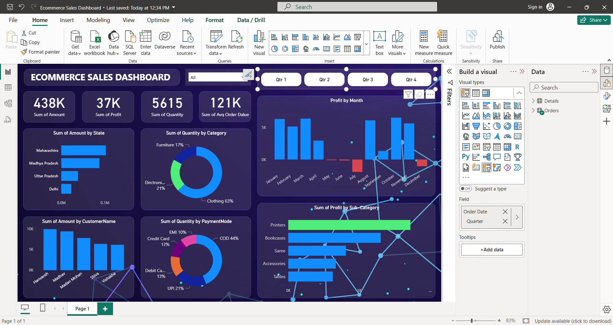

# E-commerce_Dashboard
Power BI dashboard delivers clear sales insights with interactive visuals, helping businesses track performance, identify growth opportunities, and make data-driven decisions to boost revenue.

# E‑Commerce Data Analytics – Power BI Project
A compact project to analyze an e‑commerce store’s sales and present a clean Power BI dashboard with key insights.  

# Objectives

- Sales Overview – Track overall sales performance, KPIs, and growth trends.
- Product Analysis – Identify top-selling categories, products, and sizes.
- Customer Insights – Segment customers by purchase behavior and region.
- Geographical Analysis – Visualize sales distribution across states and cities.
- Interactive Dashboards – Provide decision-makers with dynamic, drill-down reports.

## Dataset
Two sources were used:
- `Orders.csv` – order-level attributes (dates, customers, regions, etc.).
- `Details.csv` – line items (products, quantities, prices, categories, etc.).

## Project key points:
Data collection,
data cleaning and wrangling,
Data Process,
Data modeling,
Data visualization,
Dashboard design,
Sharing insight

## Business Questions
- How are sales trending over time (month/quarter/year)?
- Which categories, products and regions drive the most revenue?
- What is our Average Order Value and Profit Margin?
- Who are our top customers?
- Are there any recent trend changes to watch?

## Data Model (Concept)
- **Fact table**: Order Line Items (from `Details` joined to `Orders` by Order ID).
- **Dimensions**: Date, Customer, Product, Category, Region, Order Status.

## Visuals

## Power BI Workflow
1. Ingest CSVs via **Power Query**, enforce data types and fix anomalies.
2. Create relationships (Order → Order Lines), and a Calendar table for time intel.
3. Author DAX measures for KPIs and trends (Total Sales, AOV, Profit Margin, YoY, MoM).
4. Build visuals: line for trends, bar for categories/regions, and a KPI card row.
5. Add slicers for Date, Category, Region and Customer; enable drill-down.
6. Polish the UI: consistent fonts, thousand separators, tooltips, bookmarks for views.
7. Validate with spot-checks and export PBIX/PNG for the repo.

## Learnings

**Tech Stack:**

- Power BI → Interactive dashboards & storytelling
- Data Cleaning & Transformation → Power Query (ETL process)
- Data Modeling → DAX measures, calculated columns, relationships

**Skills used:**
- Data collection & ingestion: CSVs → Power BI (Power Query) / Python
- Data cleaning & wrangling: type casting, missing values, text normalization
- Data modeling: star schema (Fact + Dimensions), relationships, calendar table
- DAX measures: Total Sales, AOV, Profit Margin, YoY/MoM (time intelligence)
- Visualization & UX: line/bar charts, slicers, drill-downs, tooltips, bookmarks
- Validation & documentation: spot checks, assumptions, clear README for GitHub
- Version control: Git/GitHub workflows for reproducibility

**Learnings**
- Built an end-to-end BI pipeline from raw CSVs to a clean, interactive dashboard.
- Designed actionable KPIs that map to ecommerce levers (revenue drivers, AOV, margin).
- Strengthened data modeling habits to avoid ambiguous relationships.
- Leveled up on DAX for time intelligence and dynamic measures.
- Improved dashboard usability (consistent formatting, legible labels, responsive layout).
- Practiced transparent documentation so others can reproduce your results.

---
